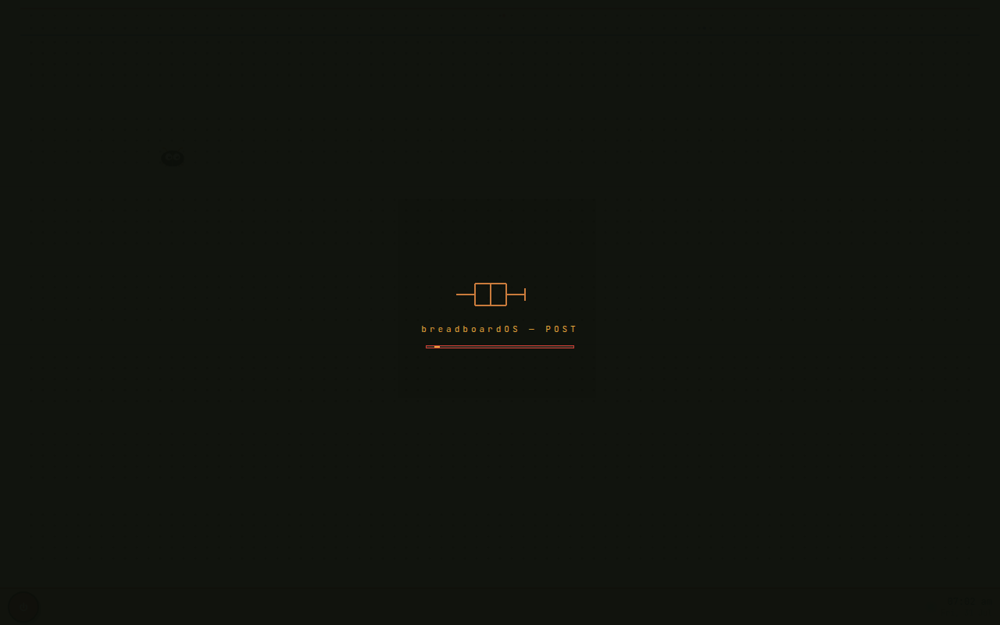
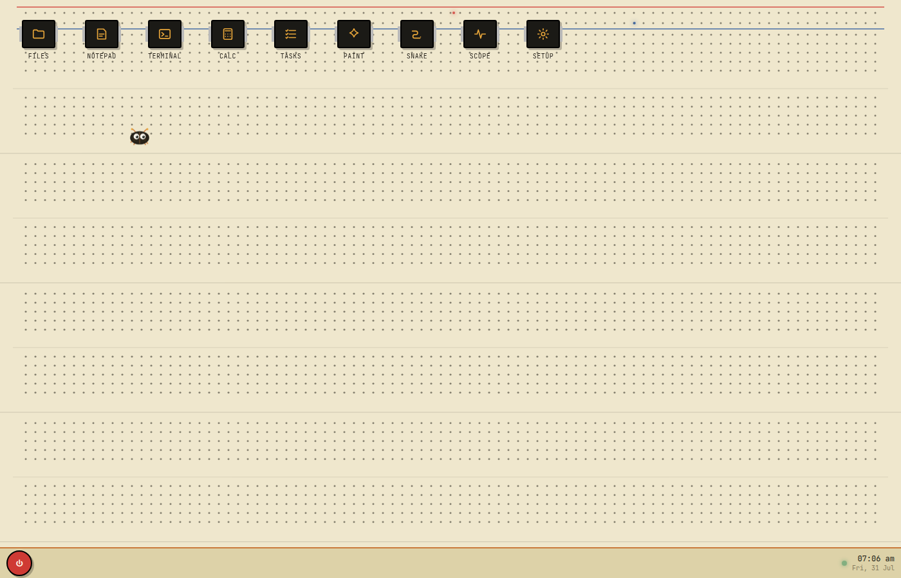
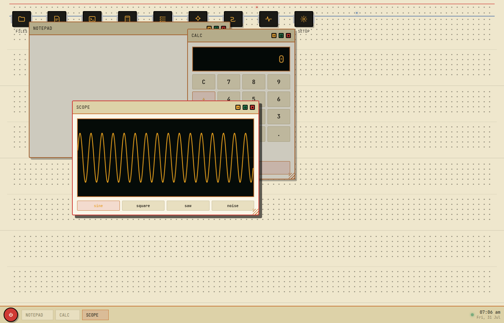

# breadboardOS

a tiny desktop that lives in your browser and looks like a solderless breadboard.

cream plastic, red/blue power rails, rows of holes, black chip icons. no frameworks, no build step — just open the html and it runs.







## what's in it

- **Files** — little virtual fs, sticks around via localStorage
- **Notepad** — write stuff, save it into that fs
- **Terminal** — toy shell (`ls`, `cat`, `echo`, etc)
- **Calc** — does math
- **Tasks** — checklist
- **Paint** — draw on a canvas
- **Snake** — because every desktop needs a snake game
- **Scope** — fake oscilloscope, sine/square/saw/noise
- **Setup** — mute beeps, change the accent color

there's also a bug that crawls around the desktop. right-click the board to feed it. it gets hungry if you ignore it.

## run it

easiest: open `index.html` in a browser.

or if you're splitting files / using live server, keep these three next to each other:

```
index.html
style.css
app.js
```

and serve the folder (live server, `python -m http.server`, whatever).

## notes

- state (files, tasks, snake high score, bug mood, accent) is all localStorage
- sounds are tiny square-wave beeps, can turn them off in Setup
- works fine offline once the fonts are cached (or just ignore the google fonts link)

built for fun. not a real OS.
